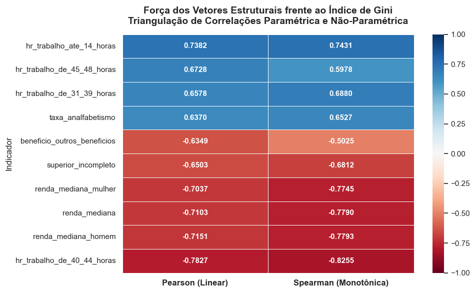
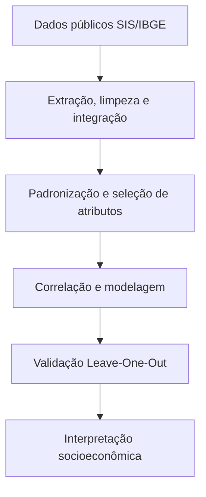
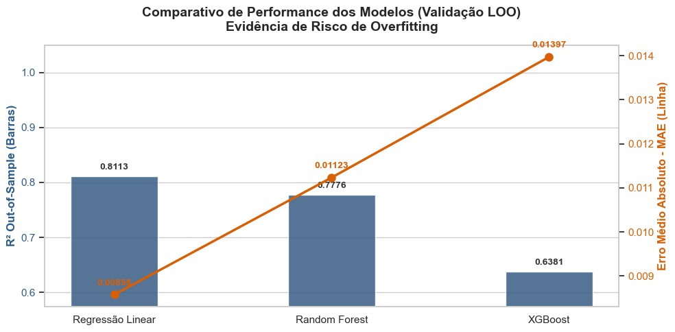
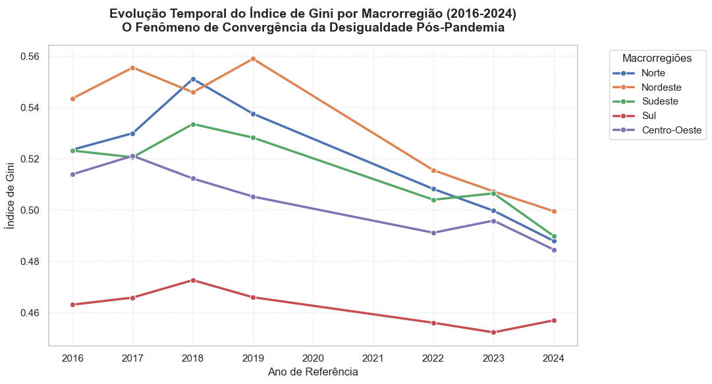

# Vulnerabilidade social nas regiões brasileiras

### Análise de indicadores socioeconômicos do IBGE com Ciência de Dados e Machine Learning (2016-2024)

[](https://www.python.org/)
[](https://jupyter.org/)
[](https://scikit-learn.org/)
[](https://www.ibge.gov.br/estatisticas/sociais/populacao/9221-sintese-de-indicadores-sociais.html)
[](#)

> Quais fatores, além da renda, estão associados à desigualdade e à vulnerabilidade social nas macrorregiões brasileiras?

Este projeto investiga a vulnerabilidade social como um fenômeno multidimensional. Dados públicos da **Síntese de Indicadores Sociais (SIS/IBGE)** foram integrados para analisar como **renda, escolaridade, condições de trabalho e proteção social** se relacionam com a desigualdade nas cinco macrorregiões do Brasil.

Mais do que prever o Índice de Gini, o estudo buscou transformar dados públicos em evidências interpretáveis sobre os fatores estruturais que acompanham a vulnerabilidade regional. O trabalho foi desenvolvido como TCC do Bacharelado em Ciência de Dados da **Universidade Virtual do Estado de São Paulo (UNIVESP)**.

## Visão geral

| Escopo | Dados | Variáveis preditoras | Modelos comparados |
|:---:|:---:|:---:|:---:|
| 5 macrorregiões | 35 observações válidas | 27 indicadores | 3 modelos |
| 2016-2024 | 7 períodos anuais | Renda, educação, trabalho e benefícios | Regressão Linear, Random Forest e XGBoost |

Os anos de 2020 e 2021 não integram a base final devido à ausência ou descontinuidade metodológica de parte dos indicadores durante a pandemia de COVID-19.

## Problema e objetivo

A desigualdade regional brasileira não pode ser compreendida somente pela renda média. Escolaridade, formalização do trabalho, subocupação e acesso a benefícios sociais também ajudam a explicar por que algumas regiões apresentam maior vulnerabilidade do que outras.

O objetivo do projeto foi **identificar os indicadores socioeconômicos mais associados à variação do Índice de Gini** entre as macrorregiões brasileiras, construindo um processo analítico que permitisse:

- integrar diferentes tabelas públicas do IBGE;
- comparar relações lineares e não lineares entre os indicadores;
- avaliar modelos preditivos com controle de overfitting;
- interpretar quais dimensões aparecem com maior relevância;
- produzir evidências que possam apoiar discussões sobre políticas públicas.

## Principais resultados

- A **Regressão Linear** apresentou o melhor desempenho fora da amostra: **R² = 0,8113**, **MAE = 0,00858** e **RMSE = 0,01268**.
- A proporção de pessoas com jornada semanal de **40 a 44 horas** teve a associação inversa mais forte com o Índice de Gini: **Pearson = -0,7827** e **Spearman = -0,8255**.
- A jornada de até **14 horas semanais**, associada à subocupação, apresentou correlação positiva com o Gini: **Pearson = +0,7382**.
- Taxa de analfabetismo e população sem instrução também apresentaram associação positiva com maior desigualdade.
- No Random Forest, as variáveis de jornada de trabalho concentraram mais de **36% da importância global**, seguidas por renda mediana e benefícios sociais.

> **Leitura responsável:** os resultados indicam associações estatísticas nos dados analisados; não estabelecem, isoladamente, relações causais.

## Correlações com o Índice de Gini



## Desenvolvimento da análise



O desenvolvimento partiu das planilhas originais da SIS/IBGE e avançou até uma base consolidada por macrorregião e ano. O pipeline analítico reuniu:

1. Extração de planilhas públicas da SIS/IBGE.
2. Limpeza, padronização de nomes e integração por região e ano.
3. Tratamento de valores ausentes, codificação das regiões e normalização por Z-Score.
4. Análise de correlação linear e monotônica com Pearson e Spearman.
5. Comparação entre Regressão Linear, Random Forest e XGBoost.
6. Validação cruzada **Leave-One-Out (LOO)**, adequada à amostra compacta.
7. Interpretação por coeficientes, importância de atributos e visualizações regionais.

### Decisões metodológicas

- O **Índice de Gini** foi definido como variável-alvo.
- O Índice de Palma foi retirado da modelagem para reduzir multicolinearidade e evitar circularidade entre métricas de desigualdade.
- Random Forest e XGBoost foram deliberadamente simplificados para limitar o risco de overfitting.
- A Regressão Linear foi priorizada para predição; o Random Forest foi usado como apoio à interpretação das importâncias devido à instabilidade dos coeficientes lineares sob multicolinearidade.

## Desempenho dos modelos

| Modelo | MAE ↓ | RMSE ↓ | R² fora da amostra ↑ |
|---|---:|---:|---:|
| **Regressão Linear** | **0,00858** | **0,01268** | **0,81128** |
| Random Forest simplificado | 0,01123 | 0,01376 | 0,77759 |
| XGBoost simplificado | 0,01397 | 0,01755 | 0,63808 |



O resultado reforça uma conclusão importante: **o modelo mais complexo nem sempre é o mais adequado**. Com apenas 35 observações, a abordagem linear ofereceu melhor generalização e maior parcimônia.

## Evolução regional do Índice de Gini



## Conclusões do projeto

Os resultados sustentam que a vulnerabilidade social regional é um fenômeno **multidimensional**. A renda permanece relevante, mas não explica sozinha as diferenças observadas entre as regiões brasileiras.

1. **A estrutura do mercado de trabalho foi o principal eixo analítico.** A maior presença de jornadas formais de 40 a 44 horas esteve associada a menores níveis de desigualdade, enquanto jornadas muito reduzidas estiveram relacionadas a maior vulnerabilidade.
2. **Educação e desigualdade caminharam juntas.** Analfabetismo e ausência de instrução apresentaram associação positiva com o Índice de Gini, reforçando o papel das barreiras educacionais na manutenção das diferenças regionais.
3. **A renda mediana foi mais informativa do que uma leitura baseada apenas na média.** O fortalecimento da renda do trabalhador localizado no centro da distribuição esteve associado à redução da desigualdade.
4. **Benefícios sociais apareceram como mecanismos relevantes de proteção.** Eles podem ajudar a conter situações imediatas de vulnerabilidade, embora os resultados indiquem que educação e inserção ocupacional estável são fundamentais para mudanças sustentáveis de longo prazo.
5. **Modelos mais complexos não garantiram melhor resultado.** Diante da amostra reduzida, a Regressão Linear generalizou melhor do que Random Forest e XGBoost. Essa decisão preservou a interpretabilidade e reduziu o risco de conclusões baseadas em overfitting.

Em síntese, o estudo indica que o combate à desigualdade exige uma visão integrada de **renda, educação, qualidade da ocupação e proteção social**.

## Impacto e aplicação social

O projeto demonstra como dados públicos podem ser convertidos em conhecimento aplicável ao planejamento social. O pipeline desenvolvido pode servir como ponto de partida para:

- identificar dimensões prioritárias de vulnerabilidade em cada região;
- apoiar a formulação de políticas públicas baseadas em evidências;
- orientar a alocação regional de recursos para educação, emprego e assistência social;
- acompanhar a evolução de indicadores socioeconômicos ao longo do tempo;
- comunicar desigualdades complexas de forma visual e acessível.

Os resultados não substituem estudos causais nem a análise de contexto local. Seu valor está em **revelar padrões, organizar evidências e direcionar novas investigações** sobre as diferenças socioeconômicas brasileiras.

## Limitações e próximos passos

- A base final contém 35 observações agregadas por macrorregião, o que limita o uso de modelos complexos.
- A agregação regional pode ocultar desigualdades entre estados, municípios e regiões metropolitanas.
- A ausência de parte dos indicadores em 2020 e 2021 reduz a continuidade da série histórica.
- Trabalhos futuros podem desagregar os dados, ampliar a série temporal e avaliar métodos de inferência causal.

## Tecnologias

- **Python** para todo o pipeline analítico.
- **pandas** e **NumPy** para manipulação e transformação dos dados.
- **SciPy** para correlações de Pearson e Spearman.
- **scikit-learn** para pré-processamento, validação e modelagem.
- **XGBoost** como modelo de boosting para comparação.
- **Matplotlib** e **Seaborn** para visualização dos resultados.
- **Jupyter Notebook** para análise exploratória e documentação dos experimentos.

## Estrutura do repositório

```text
Analise-IBGE/
├── data/raw/                                  # Planilhas originais da SIS/IBGE
├── docs/images/                               # Visualizações usadas neste README
├── notebooks/
│   ├── Analise_final.ipynb                    # Análise final, validação e resultados
│   ├── analise_exploratoria_ibge.ipynb        # Exploração e tratamento inicial
│   ├── analise_modelos_e_tabela_oficial.ipynb # Integração histórica e modelagem
│   └── juntar_dados_historicos.ipynb          # Consolidação das séries históricas
├── src/                                       # Espaço para modularização do pipeline
└── requirements.txt
```

## Como executar

```bash
git clone https://github.com/joaohs1/Analise-IBGE.git
cd Analise-IBGE

python -m venv .venv
source .venv/bin/activate  # Windows: .venv\Scripts\activate

pip install pandas numpy scipy matplotlib seaborn scikit-learn xgboost openpyxl xlrd jupyterlab

cd notebooks
jupyter lab Analise_final.ipynb
```

Os notebooks usam caminhos relativos. Para reproduzir a análise, execute-os a partir da pasta `notebooks/` e mantenha a estrutura de diretórios do projeto.

## Apresentação do TCC

[Assista à apresentação do projeto no YouTube](https://youtu.be/cqjqh7FJpxI).

## Créditos acadêmicos

Projeto acadêmico desenvolvido por:

- Angra Dias de Oliveira
- Elder Rodrigues da Costa
- Felipe Soares Oliveira da Silva
- Jennifer Barbosa Schultz
- João Henrique da Silva
- Luciano da Cunha Lopes
- Marcos Yong
- Murilo Omiramar da Silva Santos

Orientação: Prof. Gian Franco Joel Condori Luna - UNIVESP.

---

